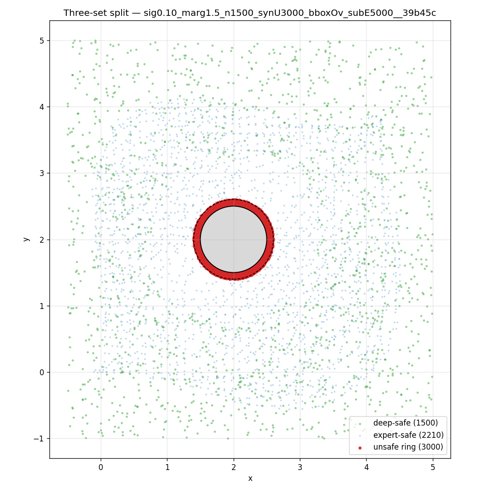
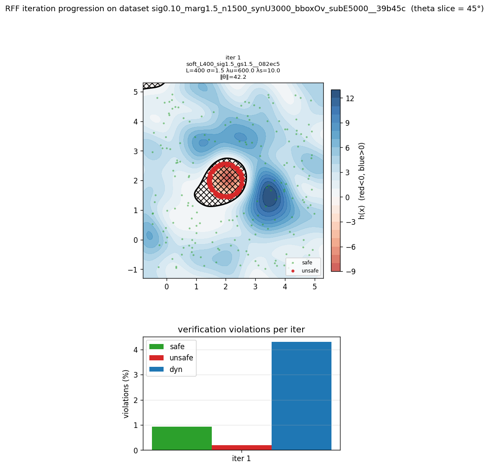

# Preliminary results

## Best run so far

**Tag:** `soft_L400_sig1.5_gs1.5__082ec5` (method: RFF, soft-constrained QP, CLARABEL)
**Dataset:** `sig0.10_marg1.5_n1500_synU3000_bboxOv_subE5000__39b45c`
**Status:** Pareto-optimal on (v_total, runtime_s, ‖θ‖) across the 11 runs in the current index.

### Verification violations

| metric    | value   |
|-----------|---------|
| `v_safe`   | 0.93 %  |
| `v_unsafe` | 0.20 %  |
| `v_dyn`    | 4.30 %  |
| `v_total`  | 3.28    |

`v_total = v_safe + v_unsafe + 0.5 · v_dyn`. Unsafe leakage is the only hard safety concern and stays at 0.20 % — i.e. 6 of 3000 synthesized unsafe samples fall above the `-γ_unsafe` threshold.

### Model / training parameters

| key            | value      |
|----------------|------------|
| `mode`           | soft       |
| `n_features` (L) | 400        |
| `sigma` (σ)      | 1.5        |
| `seed`           | 42         |
| `gamma_safe`     | 1.5        |
| `gamma_unsafe`   | 1.5        |
| `gamma_dyn`      | 0.05       |
| `lam_safe`       | 10.0       |
| `lam_unsafe`     | 600.0      |
| `lam_dyn`        | 40.0       |
| `lam_param`      | 0.3        |
| `solver`         | CLARABEL   |
| `theta_norm`     | 42.17      |
| `runtime_s`      | 29.14      |

### Dataset parameters

| key                | value                 |
|--------------------|-----------------------|
| source trajectories | `legacy_set_02_src__src` |
| sigma (noise)       | 0.10                  |
| deep-set target     | 1500                  |
| deep-set margin     | 1.5                   |
| obstacle            | center (2.0, 2.0), r = 0.5 |
| synthetic unsafe N  | 3000                  |
| bbox override       | `-0.5, 5.0, -1.0, 5.0`|
| subsample expert    | 5000 (bins 40×40×8)   |
| resulting counts    | safe 1500 · unsafe 3000 · expert 2210 |

Dataset diagnostics from the analysis notebook: knn_p95 = 0.45, xy_occupancy = 0.85, xy_entropy_frac = 0.83, heading_mean = 1.55, boundary_safe_ratio = 0.029.

### Dataset used

### Learned barrier function

Level sets at θ-slice = 45°. Black contour is the zero level set; red = `h<0` (unsafe-classified), blue = `h>0` (safe-classified). Bottom panel: verification violations.

